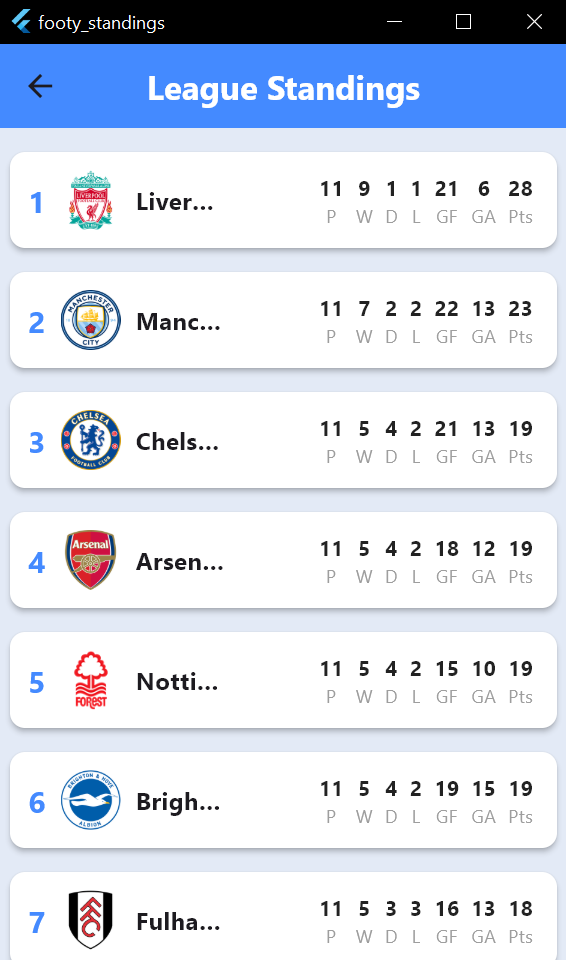
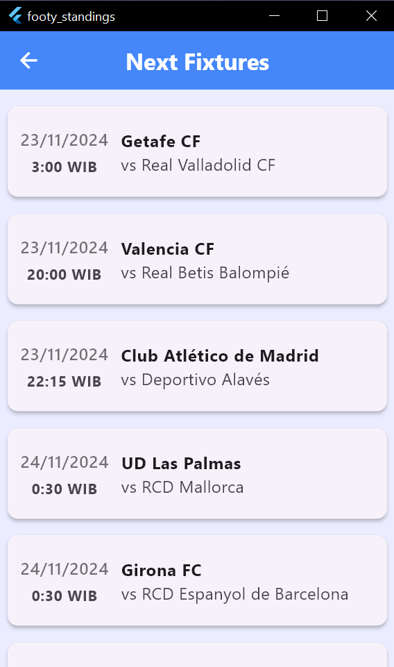
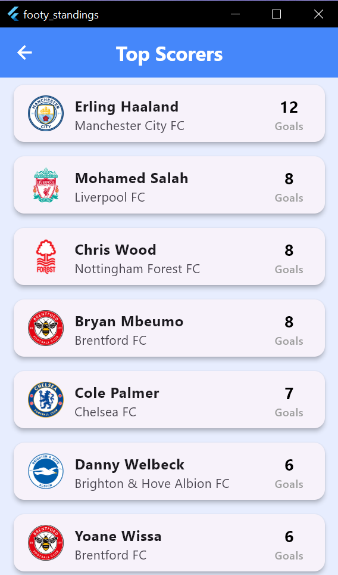
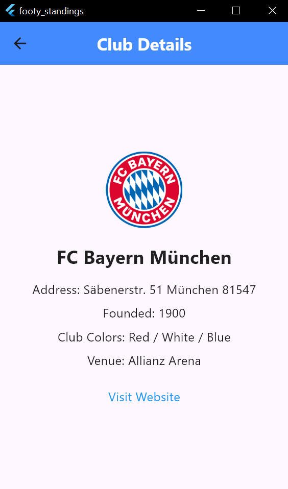

# Footy Standings ⚽

**Footy Standings** adalah aplikasi mobile berbasis Flutter yang menyediakan informasi terkini seputar sepak bola dari 6 liga top Eropa. Data diperoleh dari [Football Data API](https://www.football-data.org).

---

## Liga yang Didukung 🌍
1. **English Premier League**  
2. **Spanish La Liga**  
3. **German Bundesliga**  
4. **Italian Serie A**  
5. **French Ligue 1**  
6. **Dutch Eredivisie**

---

## Fitur Utama 🚀
1. **Klasemen Liga**  
   Menampilkan peringkat, poin, dan statistik tim di setiap liga.  

2. **Jadwal Pertandingan**  
   Informasi jadwal pertandingan mendatang dengan detail waktu, tim, dan lokasi.  

3. **Top Skor Pemain**  
   Data pencetak gol terbanyak dari masing-masing liga.  

4. **Detail Klub**  
   Informasi lengkap tentang klub, seperti nama stadion, tahun berdiri, dan logo tim.  

5. **Navigasi Sederhana**  
   Mudah digunakan dengan bottom navigation bar untuk berpindah fitur.  

---

## API yang Digunakan 📡
- **Klasemen**  
  Endpoint: `/v4/competitions/{code}/standings`  

- **Jadwal Pertandingan**  
  Endpoint: `/v4/competitions/{code}/matches?status=SCHEDULED`  

- **Top Scorers**  
  Endpoint: `/v4/competitions/{code}/scorers`  

- **Detail Klub**  
  Endpoint: `/v4/teams/{id}`  

---

## Screenshot 📸
Berikut adalah beberapa tampilan dari aplikasi **Footy Standings**:

1. **Halaman Klasemen Liga**
     
   Tampilan klasemen liga dengan detail tim dan peringkat.

2. **Halaman Jadwal Pertandingan**
     
   Tampilan jadwal pertandingan mendatang dengan informasi waktu dan tim yang bertanding.

3. **Halaman Top Skor**
     
   Daftar pencetak gol terbanyak beserta timnya.

4. **Halaman Detail Klub**
     
   Tampilan detail informasi klub dengan logo dan statistik tim.

---

✨ Jelajahi liga sepak bola favorit Anda dengan **Footy Standings**! ✨
